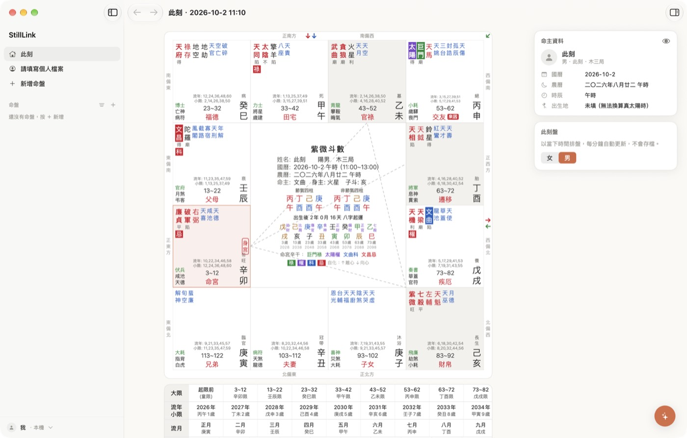

# StillLink



## 下載

到 [Releases](../../releases) 下載最新的 `StillLink-x.y.z.dmg`，打開後把 StillLink 拖進「應用程式」。

- 需要 macOS 14 以上，Apple 晶片與 Intel 都可以用。
- 目前還沒有經過 Apple 公證，第一次打開會出現「未打開 StillLink」，先按「完成」（不要丟到垃圾桶），再用下面任一種方式允許一次：
  - **系統設定**：系統設定 → 隱私權與安全性 → 往下找到「已阻擋 StillLink…」→ 按「強制打開」→ 輸入密碼確認。
  - **終端機**：貼上這行按 Enter，再重新打開 StillLink：
    ```sh
    xattr -dr com.apple.quarantine /Applications/StillLink.app
    ```
- DMG 裡也有一份 `安裝說明.txt`，步驟寫得更細。

## 功能

**排盤**
- 本命盤：十四主星、輔星、雜曜、亮度、博士／將前／歲前十二神、長生十二宮
- 四化：生年四化、宮干四化飛化、離心／向心自化箭頭；庚／辛／壬／癸干四化可依流派切換
- 運限：大限、流年（含小限）、流月、流日、流時，各層四化與運限宮名疊在盤上
- 三方四正：點宮位標出三方四正與連線，長按可鎖定一組再比較另一組
- 轉宮：以任一宮為太極，各宮顯示「X之Y」
- 中宮：四柱八字（節氣／非節氣）、十神、起運、大運
- 真太陽時：填出生地自動換算

**使用**
- 側欄管理所有命盤：資料夾分組、釘選、拖曳排序、依新增時間／名稱／出生日期排序
- 命主資料、備註、照片附件、頭貼（可裁切）
- 隱藏生辰：幫客人看盤時，一鍵把出生日期、四柱、大運都遮起來
- 快捷工具：此刻盤、報數起卦、亂數起盤（西元 1～9999 年）、四柱反查
- 觸控板捏合放大盤面
- 淺色／深色模式、介面音效與觸覺回饋

資料都存在這台 Mac（`~/Library/Application Support/StillLink`）。Apple／Google 登入與雲端同步還在準備中。

## 從原始碼建置

需要 Xcode 15 以上（Swift 5.9+）。

```sh
cd apps/apple
./build.sh            # 編譯成 build/StillLink.app
./build.sh install    # 編譯並裝到「應用程式」
./build.sh dmg        # Apple 晶片＋Intel 通用版，輸出 build/StillLink-<版本>.dmg
```

改 App 圖示：`swift scripts/make-icon.swift Resources/icon-1024.png`

## 架構

```
apps/apple/
  Sources/StillLink/
    Engine/     排盤引擎：iztro 在 JavaScriptCore 裡計算（只算資料，不用 WebView），
                農曆、八字、真太陽時、飛化／自化分析用 Swift 寫
    Views/      SwiftUI 介面：側欄、盤面、運限表、資訊卡、設定
    Theme.swift 設計 token（顏色、字級）
  Resources/    iztro.min.js、bridge.js、時區資料、音效、圖示
DESIGN.md       設計規範
```

## 致謝

排盤計算使用 [iztro](https://github.com/SylarLong/iztro)（MIT License）。
